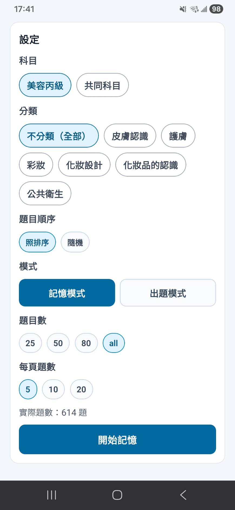
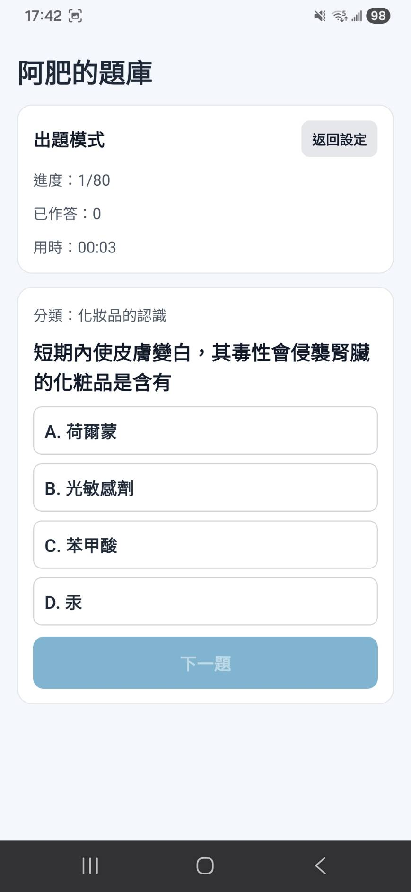

# exam_question_storage

Exam bank system for Beauty Technician (Level C) + Common Subjects (Web + Android App).

## Live URL

- Web (GitHub Pages): [https://kignite.github.io/exam_storage/](https://kignite.github.io/exam_storage/)

## Features

- Question bank generated from PDFs and normalized into JSON
- Subject switch: Beauty Technician Level C / Common Subjects
- Category-based filtering
- Study mode: show correct answers directly, supports multiple questions per page
- Quiz mode: selectable question count (25/50/80/custom 1~100), timer, final summary
- Quiz summary: score, accuracy, wrong-question review, wrong-category statistics
- Image-question support via JSON option image mapping

## Monorepo Structure

- `web/`: Next.js frontend (deployable to GitHub Pages)
- `mobile/`: React Native Android app
- `web/scripts/`: PDF-to-JSON parsing and data-fixing scripts

## Quick Start

Install dependencies:

```bash
npm install
```

Run web in development:

```bash
npm run dev:web
```

Run React Native Metro:

```bash
npm run start:mobile
```

Run Android (emulator/device required):

```bash
npm run android:mobile
```

## Build APK

Debug APK:

```bash
npm run build:apk:debug
```

Release APK:

```bash
cd mobile/android
./gradlew clean assembleRelease
```

Outputs:

- Debug: `mobile/android/app/build/outputs/apk/debug/app-debug.apk`
- Release: `mobile/android/app/build/outputs/apk/release/app-release.apk`

## Question Data

- Main dataset: `web/public/questions.json`
- Common-subject image assets: `web/public/question-images/common/`

## App Screenshots



